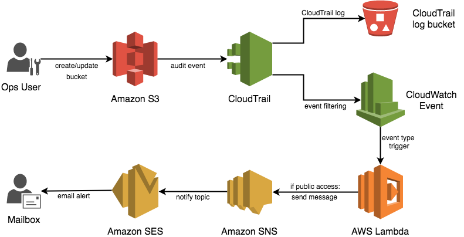

# Henry
_There's a hole in the bucket, dear Liza, dear Liza_
## Alert on Open S3 Buckets

This NodeJS lambda function is triggered by a Cloudwatch Event rule, processing CloudTrail API logs to find S3 bucket permissions changes, and sends a notification via SNS (pronounced 'snooze', fact) if the bucket has public read or public write access.

This is intended to help ensure you are aware when an S3 bucket is created or modified with public access (which could be desirable in some use cases). It will not prevent the bucket from being created.

### Overview



### Deployment

Choose either [Terraform](https://www.terraform.io/docs/providers/aws/) or [CloudFormation](https://aws.amazon.com/cloudformation/getting-started/) using the [Serverless Application Model](https://docs.aws.amazon.com/lambda/latest/dg/serverless_app.html) for deployment of the whole stack. Either one will create all of the AWS resources necessary to immediately use this in your Amazon account, from CloudTrail log to SNS topic. If you just want to use the event parsing and notification lambda then just pluck out `index.js`.

#### Terraform

##### Pre-requisites

- Terraform 
- AWS credentials in `~/.aws`
- AWS CLI tools set up (to shell out to create sns email subscription)

Before running the Terraform script you'll need to package the lambda file:
```
  zip lambda.zip index.js
```

##### Deploy

Execute the Terraform script:
```
  terraform apply
```

Two variables are prompted at template apply:
- `alert_email_address` for the target email address
- `cloudtrail_s3_bucket_name` for the CloudTrail log bucket name (must be globally unique)

Before receiving the alerts, you must confirm the SNS email subscription by clicking the link sent to your inbox.


#### CloudFormation / SAM

##### Pre-requisites

- AWS credentials in `~/.aws`
- AWS CLI tools set up (to create deployment bucket and apply template)

Create an S3 bucket to store the lambda code packaged by CloudFormation. The bucket name must be globally unique:
```
  aws s3 mb s3://<your-s3-code-bucket-name> --region <your-chosen-region>
```

##### Deploy

Create the CloudFormation package, which preprocesses the SAM template to output a regular CloudFormation template and uploads `index.js` to the S3 bucket from the previous step:
```
  aws cloudformation package \
     --template-file henry-sam.yml \
     --output-template-file sam-output.yml \
     --s3-bucket <your-s3-code-bucket-name>
```

Apply the CloudFormation template, passing in parameter values to override `AlertEmailAddress` and `S3LogBucketName`. The bucket name must be globally unique:
```
  aws cloudformation deploy \
     --template-file sam-output.yml \
     --stack-name HenryOpenS3BucketAlerts \
     --capabilities CAPABILITY_NAMED_IAM \
     --parameter-overrides  S3LogBucketName=<your-s3-log-bucket-name> \
       AlertEmailAddress=<your-email-address@inbox.com>
```

Before receiving the alerts, you must confirm the SNS email subscription by clicking the link sent to your inbox.

### Lambda Configuration

If you are reusing the lambda by itself, the function depends on an environment variable called `snsTopicArn` which must be populated with the fully qualified ARN for your SNS topic.

### Further Development

- ~~Reading the CloudTrail event details and extracting the user ID of the person/role of the service that set the S3 bucket to public and including that in the notification message.~~ ☑️ **DONE**
- ~~Add a CloudFormation template as an alternative to Terraform for provisioning.~~ ☑️ **DONE**
- Add a Serverless Application Model template to the [Serverless Application Repository](https://aws.amazon.com/blogs/aws/now-available-aws-serverless-application-repository/) to improve discoverability and reuse.
- Changing the sns topic subscription from email to a HTTP endpoint may make it relatively easy to push messages to a Slack channel when someone creates/modifies a bucket with public permissions.